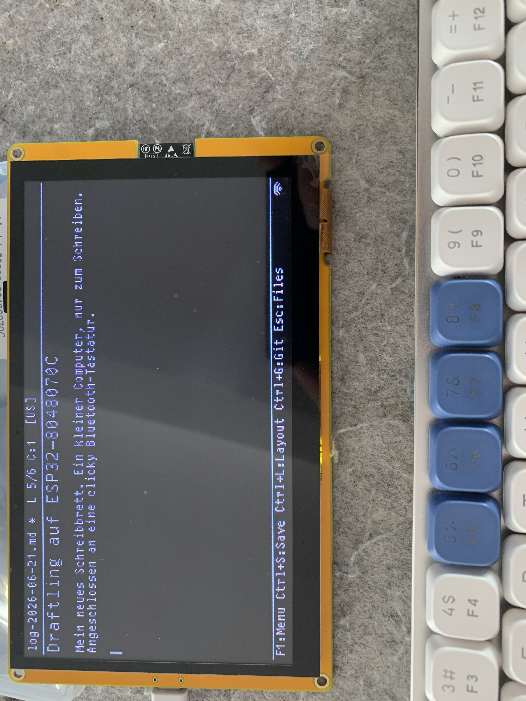

# Sunton ESP32-8048S070C -- board port notes



The Sunton ESP32-8048S070C is a 7" HMI dev board: an ESP32-S3 (16 MB
flash, 8 MB octal PSRAM) driving an 800x480 TN color panel over a
16-bit parallel RGB565 interface, with a GT911 capacitive touch
controller on I2C, a MicroSD slot on SPI, and a PWM backlight on
GPIO 2. Unlike the e-paper / reflective boards this panel is a "dumb"
RGB TFT driven directly by the ESP32-S3 LCD RGB peripheral
(`esp_lcd_new_rgb_panel`): a framebuffer in PSRAM is continuously
scanned out under the HSYNC / VSYNC / DE / PCLK timing the controller
generates.

The board is keyboard-driven like every other Draftling target (USB /
BLE). Touch is optional and off by default; when enabled it acts as a
secondary input device (cursor / scroll / tap-to-select).

References:

- LovyanGFX / Makerfabs Sunton config (Harald Kreuzer):
  https://www.haraldkreuzer.net/aktuelles/erste-schritte-mit-dem-sunton-esp32-s3-7-zoll-display-lovyangfx-und-lvgl
- Makerfabs product page:
  https://www.makerfabs.com/sunton-esp32-s3-7-inch-tn-display-with-touch.html

## Display backend

The RGB panel is driven by `components/display/display_rgb.cpp`
(compiled only when `CONFIG_DRAFTLING_DISPLAY_RGB` is set, derived
from the model choice). The backend keeps its own RGB565 framebuffer
in PSRAM, accepts `display_push_rgb565()` pushes from the LVGL port
(with `DISPLAY_SCALE` x `DISPLAY_SCALE` nearest-neighbor expansion of
each logical pixel), accumulates a dirty bounding box, and on
`display_flush()` copies just that rectangle into the scan-out
framebuffer with `esp_lcd_panel_draw_bitmap()`. A degraded per-pixel
fallback (`display_set_pixel`, 0/0xFF = black/white) covers the
splash-logo path in `editor_ui.cpp`.

`DISPLAY_SCALE` defaults to 2, so LVGL renders into a 400x240 logical
canvas that the backend up-scales to the 800x480 panel -- comfortably
large Greybeard text on the ~133 DPI 7" panel.

### Panel pins and timings

All panel data / control / backlight GPIOs are owned by the RGB
backend and baked in from the verified board reference (the LovyanGFX
Sunton config and the working `breezydemo` port on the same
hardware); they are **not** redefined in `main/app_config.h`.

| Signal     | GPIO |
| ---------- | ---- |
| HSYNC      | 39   |
| VSYNC      | 40   |
| DE         | 41   |
| PCLK       | 42   |
| DISP       | -1 (not wired) |
| Backlight  | 2 (LEDC PWM) |

| Timing parameter   | Value |
| ------------------ | ----- |
| PCLK               | 12 MHz |
| HSYNC pulse width  | 2  |
| HSYNC back porch   | 43 |
| HSYNC front porch  | 8  |
| VSYNC pulse width  | 2  |
| VSYNC back porch   | 12 |
| VSYNC front porch  | 8  |
| `pclk_idle_high`   | 1  |

12 MHz is the stable PCLK for this panel; higher rates flicker under
CPU load (per the LovyanGFX reference). `pclk_idle_high = 1` matches
the same reference.

### Color line order (R/B swap)

The 16 data lines are physically wired in R,G,B order
(R0-R4, G0-G5, B0-B4). `esp_lcd_new_rgb_panel()` maps
`data_gpio_nums[0]` to the *least-significant* bit of the 16-bit
RGB565 word and `[15]` to the most-significant, and RGB565 packs as
`R[15:11] G[10:5] B[4:0]`. The panel's blue lines must therefore sit
at `data_gpio_nums[0..4]`, green at `[5..10]`, red at `[11..15]` --
i.e. the array is listed in **B,G,R** order:

| RGB565 bits | Color group | GPIOs |
| ----------- | ----------- | ----- |
| 0..4        | B0-B4       | 15, 7, 6, 5, 4 |
| 5..10       | G0-G5       | 9, 46, 3, 8, 16, 1 |
| 11..15      | R0-R4       | 14, 21, 47, 48, 45 |

With the lines in R,G,B order red and blue came out swapped (the
"Orange on black" color scheme rendered as blue on black). Reordering
to B,G,R puts a standard RGB565 pixel on the correct color lines.

## Pins Draftling touches directly

These are defined in the `CONFIG_DRAFTLING_MODEL_SUNTON_8048S070`
block of `main/app_config.h`.

| Function        | GPIO |
| --------------- | ---- |
| SD CS           | 10 |
| SD MOSI         | 11 |
| SD MISO         | 13 |
| SD SCK          | 12 |
| Touch I2C SDA   | 19 |
| Touch I2C SCL   | 20 |
| Touch RST       | 38 |
| Touch INT       | -1 (not wired) |
| Deep-sleep wake | 0 (BOOT button, EXT0) |

The SD card is mounted via `sd_card_init_spi()` on `SPI3_HOST` (the
RGB peripheral does not use a SPI bus, so there is no contention).

## Touchscreen

The on-board GT911 is supported (`CONFIG_DRAFTLING_TOUCH_GT911`,
derived from the model choice) but `CONFIG_DRAFTLING_TOUCHSCREEN` is
opt-in -- Draftling is keyboard-driven, so touch is left off unless
the user enables it in `menuconfig` (or via the `sdkconfig.defaults.sunton`
overlay).

The GT911 INT line is not wired on the Sunton reference, so the
touchscreen component polls the controller's status register on every
LVGL tick instead of gating on an INT edge. RST is on GPIO 38; the
driver pulses it at init. Because the INT-driven I2C-address-select
reset sequence cannot be performed without an INT pin, the driver
probes both possible GT911 addresses (0x5D primary, 0x14 backup) and
rebinds if the controller drifts. The panel is natively landscape
800x480, so no axis swap or mirror is needed
(`TOUCH_SWAP_XY = TOUCH_MIRROR_X = TOUCH_MIRROR_Y = 0`).

## Flash mode

The board's flash is wired for **DIO** (verified on this hardware in
the parallel `breezydemo` port). The common ESP32-S3 default is QIO,
so `sdkconfig.defaults.sunton` overrides
`CONFIG_ESPTOOLPY_FLASHMODE_DIO=y` to ensure the bootloader comes up
reliably. PSRAM is octal at 80 MHz (the common ESP32-S3 default,
which matches this board).

## Building

The model and its board-specific overrides live in
`sdkconfig.defaults.sunton`. Select the board by passing all three
defaults files:

```
SDKCONFIG_DEFAULTS="sdkconfig.defaults;sdkconfig.defaults.esp32s3;sdkconfig.defaults.sunton" \
    idf.py set-target esp32s3
idf.py build
idf.py -p /dev/ttyUSB0 flash monitor
```

`sdkconfig.defaults.sunton` selects
`CONFIG_DRAFTLING_MODEL_SUNTON_8048S070`, forces DIO flash mode, and
enables the GT911 touchscreen.

## Cross-references

- `components/display/display_rgb.cpp` -- RGB panel backend (init, push, flush, backlight, B,G,R data order).
- `main/app_config.h` -- `CONFIG_DRAFTLING_MODEL_SUNTON_8048S070` block (SD / touch / wakeup pins).
- `main/Kconfig.projbuild` -- model choice, `DRAFTLING_DISPLAY_RGB` derived flag, width/height (800x480), `DISPLAY_SCALE` (2), GT911 / touch-RST defaults.
- `main/main.cpp` -- `display_init()` branch under `CONFIG_DRAFTLING_DISPLAY_RGB`.
- `components/display/CMakeLists.txt` -- registers `display_rgb.cpp`.
- `components/touchscreen/touchscreen.cpp` -- GT911 polled driver, dual-address probe.
- `sdkconfig.defaults.sunton` -- board selection + DIO flash + touch enable.
