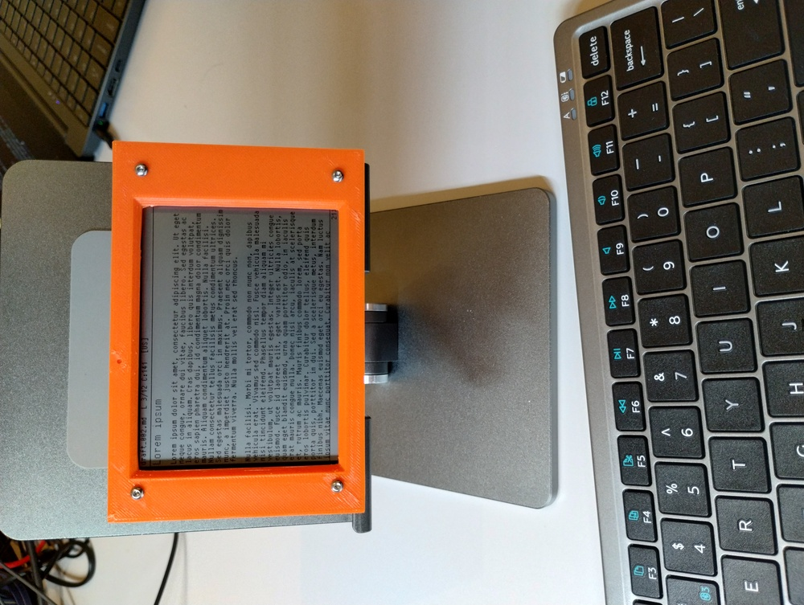
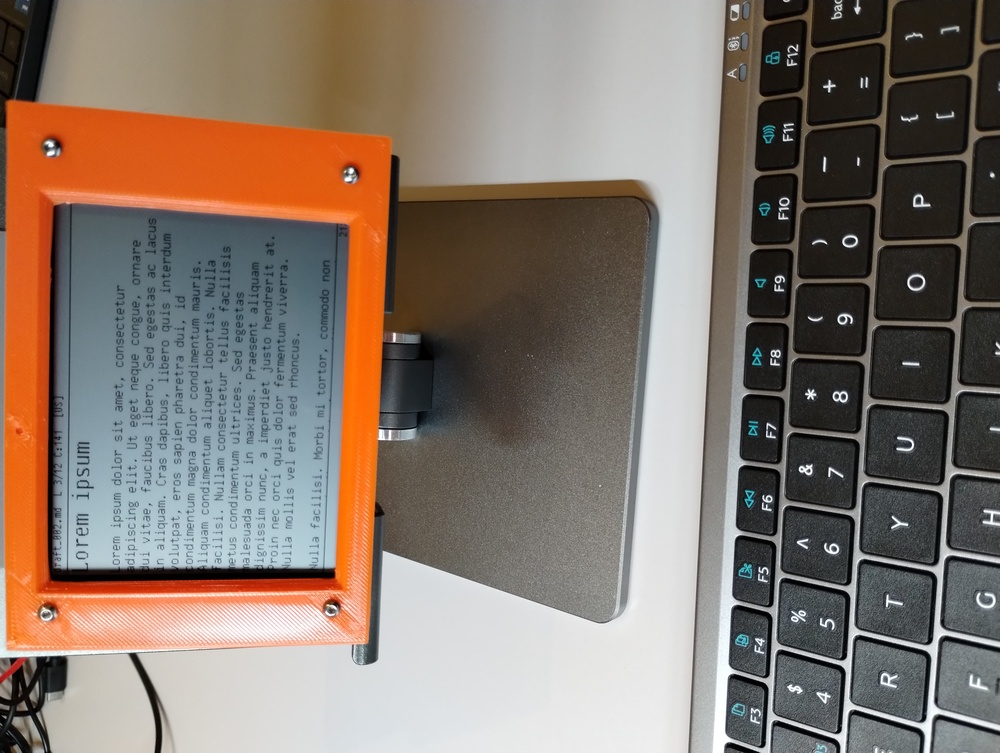
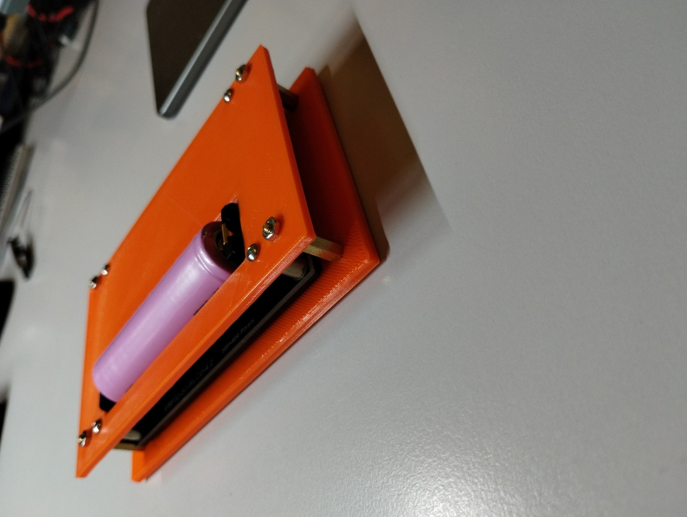
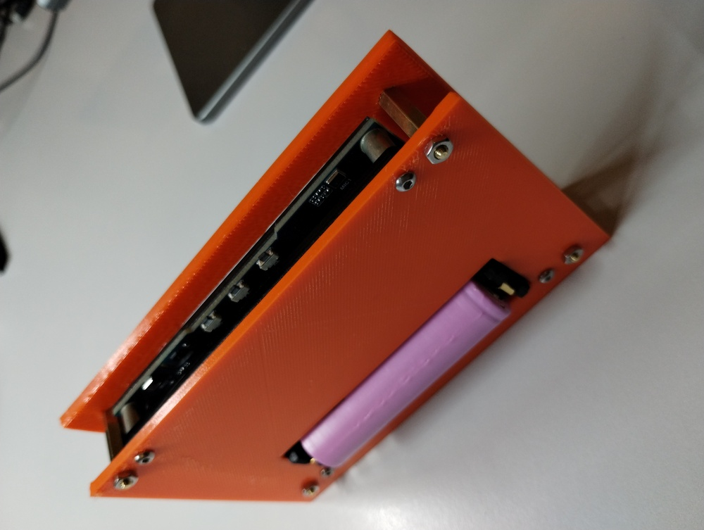
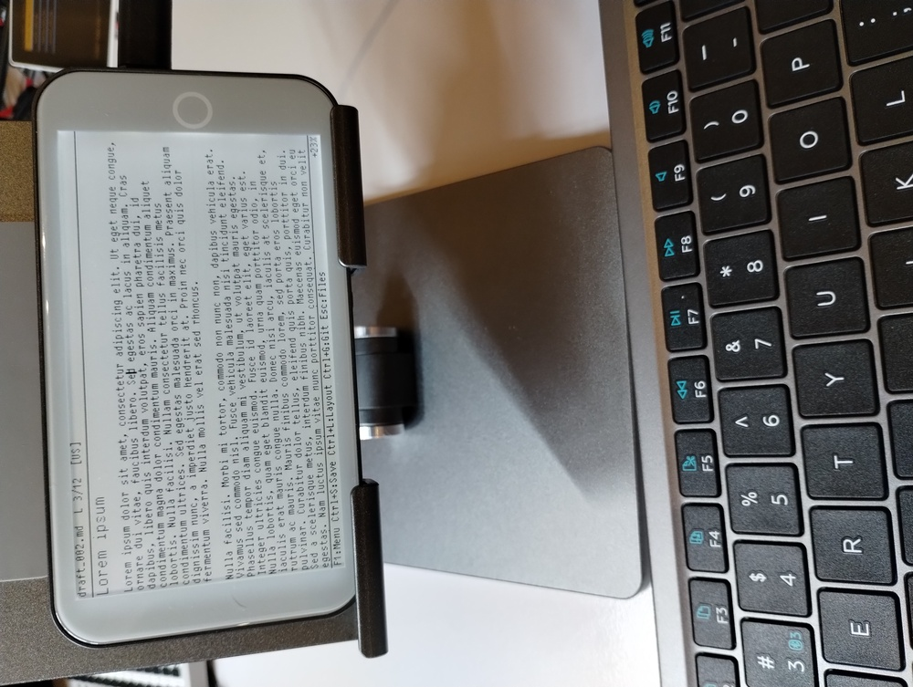
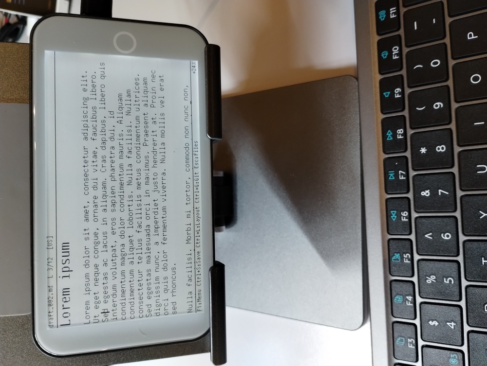
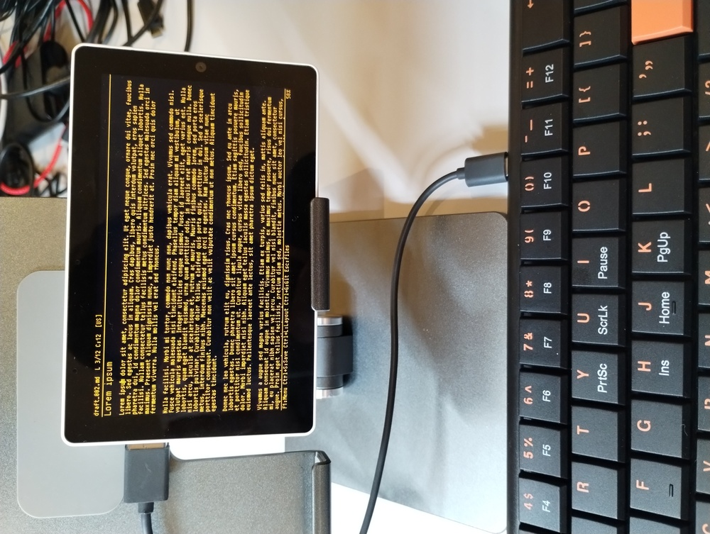
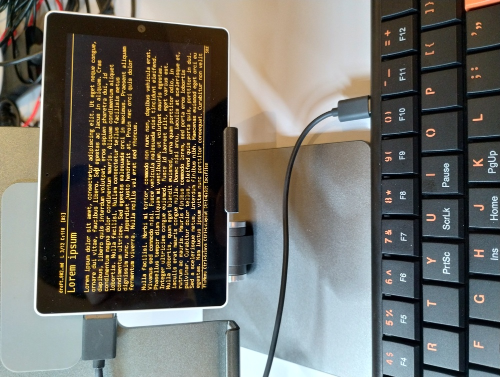
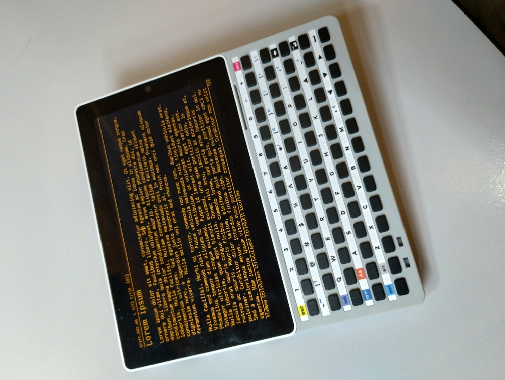
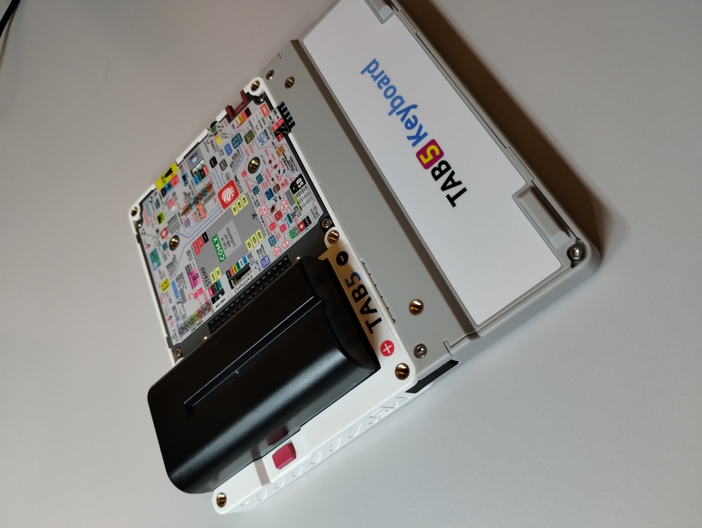

# Draftling photos

## Waveshare ESP32-S3-RLCD-4.2

[Enclosure 3D model](../3D_Prints/Waveshare_ESP32-S3-RLCD-4.2) is available for printing.

11px text:

16px text:

back panel:

control buttons:

## LilyGO T5 E-Paper S3 Pro

5% backlight, 11px font:

5% backlight, 16px font:

## M5Stack Tab5

USB keyboard, amber color theme, 11px text:

16px text:

top view:

Tab5 keyboard:

Tab5 keyboard, back view:

